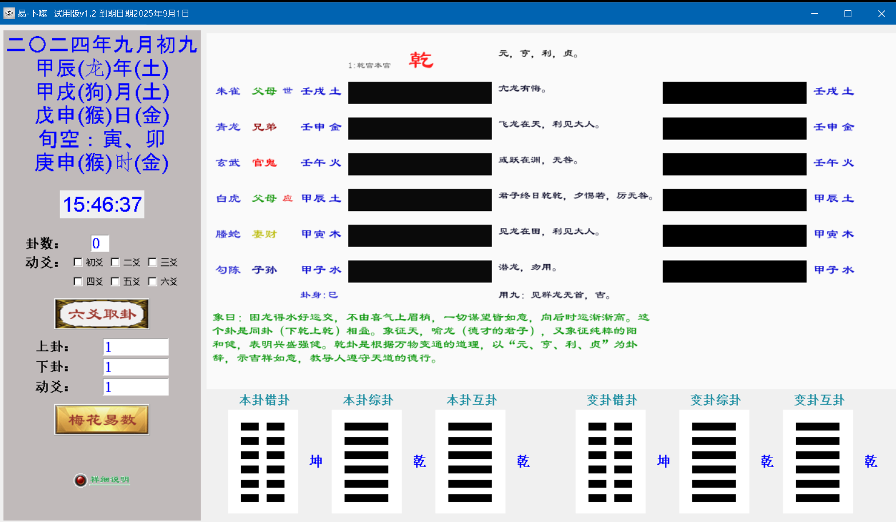

# 易经及卜卦辅助工具
适用于易经学习，快速得每卦卦辞及爻辞

适用梅花易数入门，快速用上下爻数字取卦得变错综互卦和动爻及五行属性

适用于六爻取卦入门，快速排卦，并得到六爻之世应，五行，六亲，六神等信息

## 安装教程

* python版本3.10.6,其它版本启动不了，windows下启动，yibu.cp310-win_amd64.pyd模块已经在windows下编译成了二进制，改用dist文件夹下的内容替换yibu.cp310-win_amd64.pyd可不受限制
* python -m venv yibu 创建一个叫yibu的虚拟环境以免影响其它程序

* 安装依赖模块
  yibu\Scripts\activate 启动虚拟环境
  
  requirements.txt中列出的是需要安装的模块，在此文件同目录下执行以下命令，numpy版本为1.X，装2.X会报错
  pip install -r requirements.txt -i https://pypi.tuna.tsinghua.edu.cn/simple

## 快速上手

*直接运行
  安装下依赖模块直接在程序目录中运行
  python yibuPackag.py

#主界面

# 联系交流
## QQ 2585150029
欢迎联系交流合作

